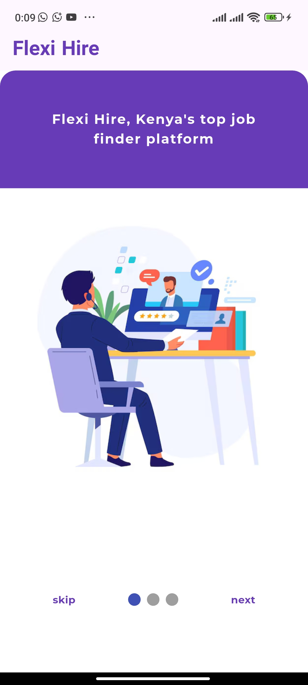
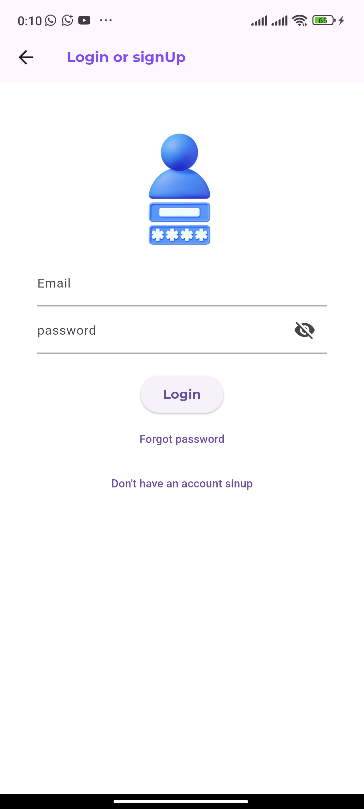
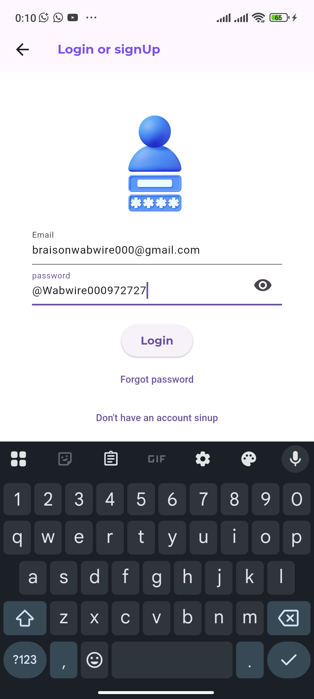
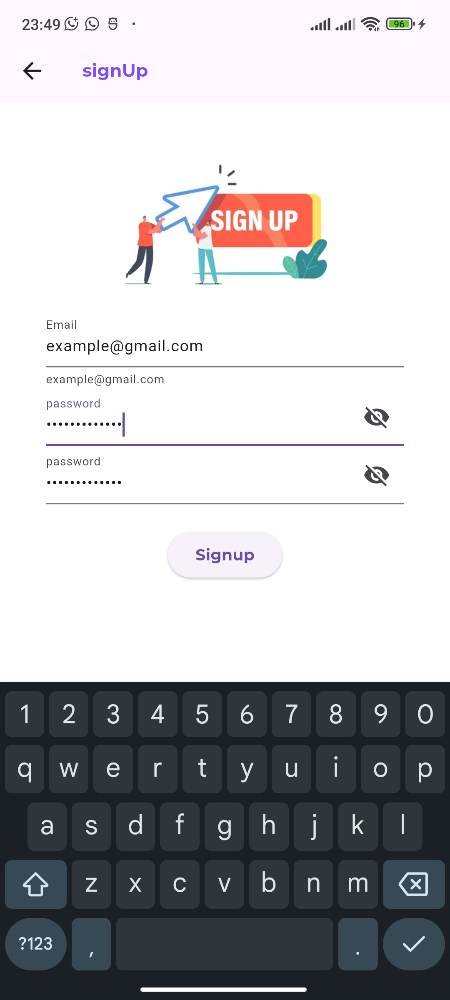

# Flexi_Hire

**Flexi_Hire** is a Flutter-based mobile application designed to connect job seekers with clients by posting job opportunities in real-time. The app aims to simplify the job hunting process and provide employers with a reliable platform to post and manage job listings.

---

## 🚀 Features

- Beautiful onboarding slides to welcome and guide users.
- Secure login page for user authentication.
- Flutter-based mobile UI/UX for smooth user experience.
- Support for image and UI previews.


## Project Screenshots

| Slide 1 | Slide 2 |
|--------|--------|
|  |  |

| Slide 3 | Slide 4 |
|--------|--------|
|  |  |

| Login Page | Signup |
|------------|------------|
|  | |


## Getting Started

### Prerequisites

- Flutter SDK (v3.x or later)
- Android Studio or VS Code
- Dart plugin
- An Android/iOS emulator or physical device

### Installation

1. **Clone the repository**
   ```bash
   git clone https://github.com/BraisonWabwire/flexi_hire.git
   cd flexi_hire
